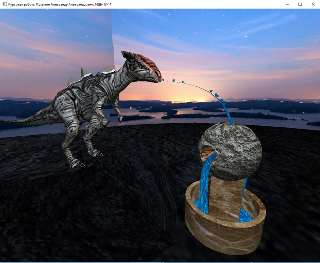
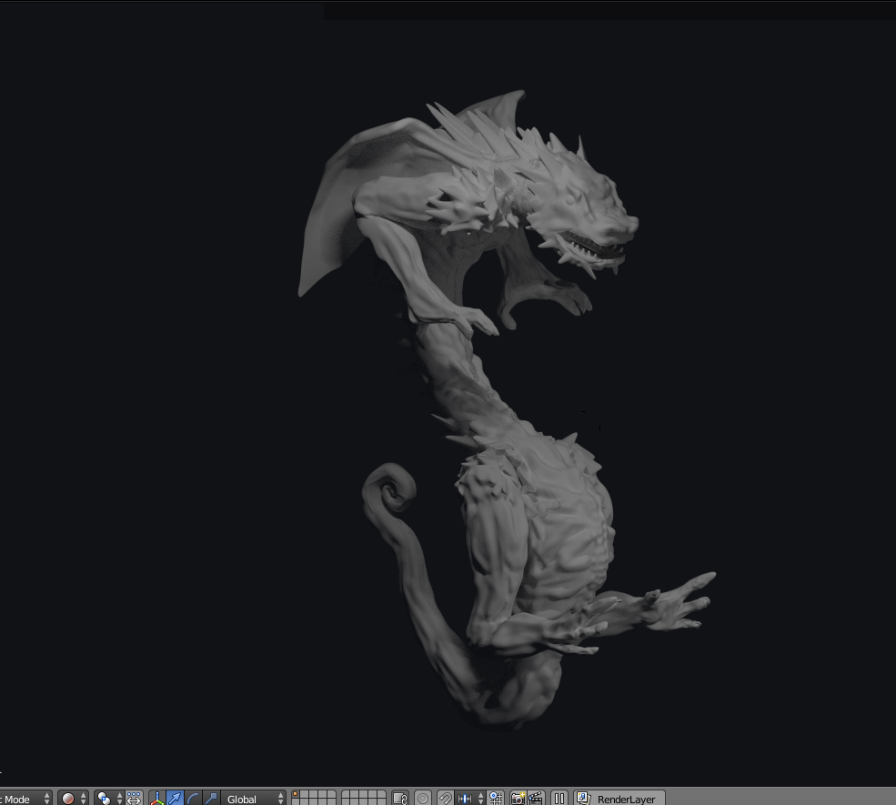

# Проект: "Анимированная трехмерная модель "Фонтан "Динозавр"

# Описание: 
Данный проект разработан на языке программирования C++ с использованием OpenGL и Blender3D. Он представляет собой визуализацию окружающей среды, фонтана, динозавра и анимированной воды с каплями.
Капли представляют собой объемные многоугольники, на которые наложена текстура воды. Они двигаются по кривым Безье, следуя по траектории этих кривых. Модель динозавра и фонтана разработаны в программе Blender3D и на них наложены текстуры. Окружающая среда представляет собой цилиндр, на который наложена текстура.
Пользователь при помощи мыши и клавиатуры, используя WASD, может осмотреть композицию с разных сторон. При нажатии на клавишу «1» источник освещения устанавливается в положение, где находится камера. При расчете освещенности учитываются материалы моделей.

Также в ходе разработки была создана трехмерная модель дракона с высокой степенью детализации.

